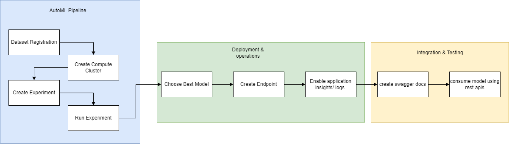

## TITLE

This is a Azure ML udacity nano Degree Project for deploying end to end MLOPS solution of model trainied on [bankmarketing dataset](https://automlsamplenotebookdata.blob.core.windows.net/automl-sample-notebook-data/bankmarketing_train.csv)

The project showcases the capabilities of Azure AutoML in operationalizing a comprehensive machine learning pipeline, covering everything from model training to API deployment and monitoring.

1. *Dataset Registration and Automated ML Experiment:* Using the Azure ML Studio interface, we first register the dataset and then create an Automated ML experiment to train classification models. This approach streamlines the model selection process by automating the training and evaluation of multiple models.

2. *Model Deployment as a REST API:* The model with the best performance is deployed as a REST API endpoint. This deployment includes Application Insights for logging and monitoring.

3. *Integration:* the API documentation is accessible via a Swagger specification. The web service can be consumed by any standard HTTP client (python code/ postman client), with an example provided using a Python script.

The AutoML experiment identifies the best-performing model, which in this case was a VotingEnsemble model. This model is then deployed as an endpoint, with Application Insights enabled for monitoring and logging. The deployment process includes obtaining the necessary URLs for scoring and interacting with the API. The model is then consumed through the endpoint by providing the appropriate keys to the environment that interacts with it. Swagger UI, an open-source tool for visually rendering API documentation, is used alongside Docker—a platform that packages software into containers—to facilitate interaction with the API.

Please refer to [Jupyter Notebook](aml-pipelines-with-automated-machine-learning-step.ipynb) for entire process

* Please refer to file wise explaination section to know more about files. [Folder structure description](#folder-structure-description)

* Please refer to [Key Steps](#key-steps) to know more about highlighting steps in preparation of this pipeline.

* Please refer to [Screen Recording](#screen-recording) to view live demonstration of execution.

* Additional steps implemented in/after pipeline development are mention in [here](#standout-suggestions)

## Architectural Diagram



## Key Steps
Here are screenshots of key steps in this pipeline development.

## Screen Recording
Here is demo video

## Future improvements
Here are some future improvement points we might consider
- addressing class imbalance
    - Downsampling: Balance the dataset by downsampling the majority class to match the minority class (in our dataset we have 2771 positive samples out of 24712, 100:11 ratior). This can help the model learn more effectively from balanced data.
    - resampling :  Increase the number of instances in the minority class by duplicating them. Techniques like SMOTE (Synthetic Minority Over-sampling Technique) can generate synthetic samples.
- Hyperparameter Tuning:
    - Exhaustive Grid Search: While it may not significantly boost performance, a more exhaustive grid search could uncover better hyperparameter combinations, potentially improving model accuracy.
- Scaling Methods:
    - Apply Scaling: Implement scaling methods (e.g., StandardScaler, MinMaxScaler) in the Logistic Regression pipeline to ensure features are on the same scale. This can lead to faster convergence and better performance.
- Model Selection for Production:
    - Avoid VotingEnsemble: For production, choose the best performing individual model (e.g., XGBoost Classifier) over VotingEnsemble to maintain inference speed and model explainability.

# Folder structure description

```
- screenshots/* : images of steps followed in pipeline execution
- starter_files/* : Reference/original task files provided by Udacity for project setup & Execution.
- swagger/* : Swagger API related setup
- aml-pipelines-with-automated-machine-learning-step.ipynb : Main program file
- benchmark.sh : apache benchmark script to evaluate performance
- endpoint.py : test script to test api results for 2 clients data.
- logs.py : enables the deployed endpoint Application Insights

```